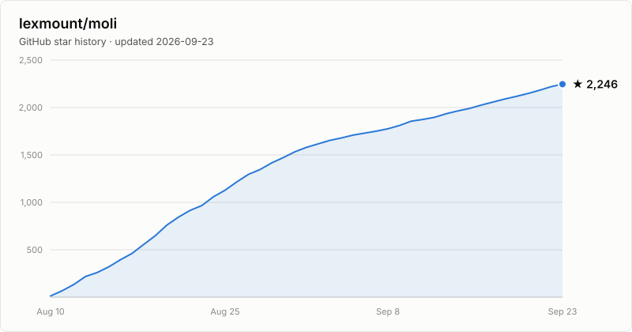

# moli-metrics

Machine-generated public metrics and charts for [Moli](https://github.com/lexmount/moli).
This repository is automatically maintained — data and charts are regenerated weekly by GitHub Actions.

## Star history

<picture>
  <source media="(prefers-color-scheme: dark)" srcset="assets/star-history-dark.svg">
  
</picture>

## Embedding

To embed the chart elsewhere (e.g. moli's README), hot-link the raw SVGs:

```html
<picture>
  <source media="(prefers-color-scheme: dark)"
          srcset="https://raw.githubusercontent.com/lexmount/moli-metrics/main/assets/star-history-dark.svg">
  
</picture>
```

## How it works

- [`scripts/update_star_history.py`](scripts/update_star_history.py) fetches star data for
  `lexmount/moli`, writes [`data/stars.json`](data/stars.json), and renders the SVGs in
  [`assets/`](assets/). No dependencies beyond the Python standard library.
- [`.github/workflows/update-star-history.yml`](.github/workflows/update-star-history.yml)
  runs weekly (Monday 02:17 UTC) and commits only when the data changed.
- With a `STAR_HISTORY_TOKEN` Actions secret (a token with read access to the target repo's
  stargazer timeline), the full history is reconstructed on every run. Without it, the script
  falls back to appending one snapshot of the current count per run.
